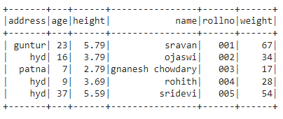
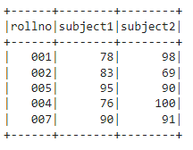
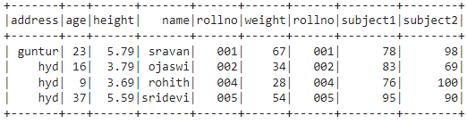
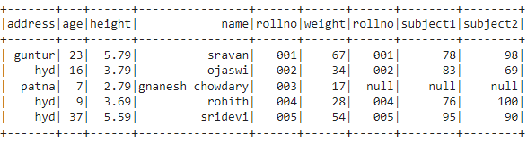
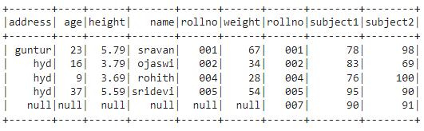
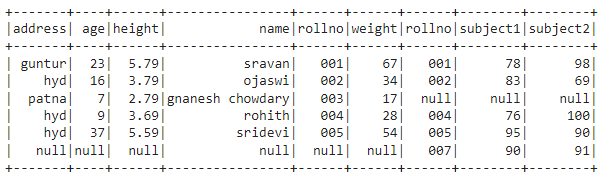

# SQL Query to PySpark Convertor

Hello everyone today we are going to build a program to convert SQL queries to Pyspark.


Spark is rapidly becoming one of the most widely adopted frameworks for big data processing. But why work in native PySpark instead of SQL?

Well, you don’t have to. PySpark allows you to [create a tempView](https://spark.apache.org/docs/latest/api/python/reference/api/pyspark.sql.DataFrame.createOrReplaceTempView.html) that does not sacrifice runtime performance. On the backend, spark runs the same transformations regardless of the language, in the exact same way. So, if you want to stick to SQL your code won’t execute any differently.

However, when working in the DataFrame API you will get compile-time errors whereas with raw SQL you’ll get errors at runtime. **If you’re working with large data, the same error can be surfaced much earlier when working in native PySpark.**

In this post we will leverage [Spark: the Definitive Guide](https://www.amazon.com/Spark-Definitive-Guide-Processing-Simple/dp/1491912219) and sequentially handle each clause in a basic SQL query and explain how to duplicate this logic in PySpark.

Without further ado, let’s dive in…

# SELECT

Any good SQL query starts with a SELECT statement — it determines what columns will be pulled and whether they should be transformed or renamed.

## SQL

```
SELECT 
  column_1,
  CASE WHEN column_2 IS NULL THEN 0 ELSE 1 END AS is_not_null,
  SUM(column_3) OVER(PARTITION BY column_1)
```

## PySpark

<iframe src="https://towardsdatascience.com/media/a9328b3382843bde757c119e7d351e19" allowfullscreen="" frameborder="0" height="171" width="680" title="" class="ds n gv dh bf" scrolling="auto" style="box-sizing: inherit; top: 0px; width: 680px; height: 171px; position: absolute; left: 0px;"></iframe>

As shown above, SQL and PySpark have very similar structure. The `df.select()` method takes a sequence of strings passed as positional arguments. Each of the SQL keywords have an equivalent in PySpark using: dot notation e.g. `df.method()`, `pyspark.sql`, or `pyspark.sql.functions`.

Pretty much any SQL select structure is easy to duplicate with some googling for the SQL keywords.

> Tip: use `*df.selectExpr()*` to run SQL commands with SQL strings.

# FROM

Now our SELECT statements are worthless without a good FROM clause.

## SQL

```
FROM df
```

## PySpark

<iframe src="https://towardsdatascience.com/media/a7163d93d01b9c9a9a0917e5150f0362" allowfullscreen="" frameborder="0" height="61" width="680" title="FROM_pyspark.py" class="ds n gv dh bf" scrolling="auto" style="box-sizing: inherit; top: 0px; width: 680px; height: 61px; position: absolute; left: 0px;"></iframe>

Pretty complex, right?

As shown above, the FROM table is defined by the DataFrame you reference prior to a method.

If you’re accustomed to using CTE’s in your SQL code, you can duplicate CTE logic by assigning a set of transformations to a variable.

<iframe src="https://towardsdatascience.com/media/d9658977cc424376706253b14a8c45f6" allowfullscreen="" frameborder="0" height="127" width="680" title="CTE_pyspark.py" class="ds n gv dh bf" scrolling="auto" style="box-sizing: inherit; top: 0px; width: 680px; height: 126.984px; position: absolute; left: 0px;"></iframe>

# WHERE

The WHERE clause is an underrated clause that can dramatically improve query time. In PySpark, there are two [identical methods](https://stackoverflow.com/questions/38867472/spark-select-where-or-filtering) that allow you to filter data: `df.where()` and `df.filter()`.

## SQL

```
WHERE column_2 IS NOT NULL 
  AND column_1 > 5
```

## PySpark

<iframe src="https://towardsdatascience.com/media/e592ced857db963cce8e0b02da882b74" allowfullscreen="" frameborder="0" height="237" width="680" title="WHERE_pyspark.py" class="ds n gv dh bf" scrolling="auto" style="box-sizing: inherit; top: 0px; width: 680px; height: 236.984px; position: absolute; left: 0px;"></iframe>

As you’ll note above, both support SQL strings and native PySpark, so leveraging SQL syntax helps smooth the transition to PySpark. But, for readability and error-raising purposes, completely native PySpark should (probably) be the end goal.

# JOIN

JOINs are another very underrated clause — if you can get really good at joins, the number of bugs in your code decreases dramatically. According to [Spark: the Definitive Guide](https://www.amazon.com/Spark-Definitive-Guide-Processing-Simple/dp/1491912219), there are 8 broad categories of joins, some of which include INNER and LEFT OUTER.

We won’t be covering each, but in general PySpark joins follow the below syntax:

```
<LEFT>.join(<RIGHT>, <JOIN_EXPRESSION>, <JOIN_TYPE>)
```

- `<LEFT>` and `<RIGHT>` are PySpark DataFrames
- `<JOIN_EXPRESSION>` is boolean comparison between columns in the two DataFrames
- `<JOIN_TYPE>` is a string which determines the join type

## SQL

```
FROM table_1
INNER JOIN table_2
  ON table_1.x = table_2.y
```

## PySpark

<iframe src="https://towardsdatascience.com/media/d9658977cc424376706253b14a8c45f6" allowfullscreen="" frameborder="0" height="127" width="680" title="CTE_pyspark.py" class="ds n gv dh bf" scrolling="auto" style="box-sizing: inherit; top: 0px; width: 680px; height: 126.984px; position: absolute; left: 0px;"></iframe>

> Tip: use `<DF>.dropDuplicates().count() == <DF>.count()`to check if you have duplicates in the left, right, or joined tables. These errors are sometimes hard to spot of you’re not looking for them.

# GROUP BY

Moving on to the more complex SQL concept of grouping, PySpark has very similar syntax to pandas in this realm.

## SQL

```
SELECT
  column_1,
  SUM(column_3) AS col_3_sum
FROM df
GROUP BY 1
```

## PySpark

<iframe src="https://towardsdatascience.com/media/6c2ef8ed6547fc61d93775a5623f04d5" allowfullscreen="" frameborder="0" height="105" width="680" title="GROUPBY_pyspark.py" class="ds n gv dh bf" scrolling="auto" style="box-sizing: inherit; top: 0px; width: 680px; height: 105px; position: absolute; left: 0px;"></iframe>

There are many different ways to group data in PySpark, however the most versatile syntax is the above. We leverage `.agg()` and pass many positional arguments that define how we transform the columns. Note that we can chain `.alias()` to rename our column to something more usable than `sum(column_3)`.

If you memorize this syntax you’ll always be able to make any transformation you want. To be perfectly clear, the syntax is…

```
df.groupBy(['<col_1>','<col_2>',...]).agg(
  F.<agg_func>('<col_3>').alias('<name_3>'),
  F.<agg_func>('<col_4>').alias('<name_4>'),
  ...
)
```

For a list of aggregation functions and examples of each, check out [sparkbyexamples](https://sparkbyexamples.com/pyspark/pyspark-aggregate-functions/).

# PySpark – SQL Joins

11 months ago

by [Gottumukkala Sravan Kumar](https://linuxhint.com/author/gottumukkalask/)

In Python, PySpark is a Spark module used to provide a similar kind of Processing like Spark using DataFrame.


In PySpark, SQL Joins are used to join two or more DataFrames based on the given condition. We just need to pass an SQL Query to perform different joins on the PySpark DataFrames. Spark.sql() is used to perform SQL Join in PySpark. Before that, we have to create a temporary view for the two PySpark DataFrames using createOrReplaceTempView() method. On this view, we can perform SQL Joins.

**Syntax:**

<iframe frameborder="0" src="https://cbd013551286a07e7258eda9a731f0b0.safeframe.googlesyndication.com/safeframe/1-0-40/html/container.html?upapi=true" id="google_ads_iframe_/18190176,22488008280/AdThrive_Content_1/5c9b6001b80bec0dfaf0b493_0" title="3rd party ad content" name="" scrolling="no" marginwidth="0" marginheight="0" width="728" height="90" data-is-safeframe="true" sandbox="allow-forms allow-popups allow-popups-to-escape-sandbox allow-same-origin allow-scripts allow-top-navigation-by-user-activation" role="region" aria-label="Advertisement" tabindex="0" data-google-container-id="5" data-load-complete="true" style="box-sizing: border-box; border: 0px; font-size: 18.2858px; margin: 0px; outline: 0px; padding: 0px; vertical-align: bottom; max-width: 100%; position: relative; width: 728px !important;"></iframe>


dataframe.createOrReplaceTempView(“view_name”)

Where:

1. DataFrame is the PySpark DataFrame.
2. view_name is the temporary name for the DataFrame.

There are different joins which are applied on the two PySpark DataFrames. Before going to know these types, let’s create two PySpark DataFrames.


[PySpark SQL Case When](https://linuxhint.com/pyspark-sql-case-when/)


[PySpark • union & unionAll](https://linuxhint.com/pyspark-union-and-unionall/)


[How to Concatenate columns in PySpark DataFrame](https://linuxhint.com/concatenate-columns-pyspark-dataframe/)


[PySpark • Lit()](https://linuxhint.com/pyspark-lit/)


[Convert PySpark DataFrame Into Pandas DataFrame](https://linuxhint.com/convert-pyspark-pandas-dataframe/)


[Add New Column To The PySpark DataFrame](https://linuxhint.com/add-new-column-pyspark-dataframe/)


[PySpark • drop()](https://linuxhint.com/drop-pyspark/)


[Standard Deviation in PySpark](https://linuxhint.com/standard-deviation-pyspark/)


[PySpark • sum()](https://linuxhint.com/sum-pyspark/)


[PySpark • sumDistinct() &countDistinct()](https://linuxhint.com/sumdistinct-countdistinct-pyspark/)


[PySpark • min()](https://linuxhint.com/min-pyspark/)


[PySpark • mean()](https://linuxhint.com/mean-pyspark/)


[PySpark • max()](https://linuxhint.com/max-pyspark/)


[PySpark • distinct()](https://linuxhint.com/distinct-pyspark/)


[PySpark • count()](https://linuxhint.com/count-pyspark/)


[PySpark • avg()](https://linuxhint.com/avg-pyspark/)


[PySpark • withColumnRenamed method](https://linuxhint.com/withcolumnrenamed-pyspark/)


[PySpark • withColumn method](https://linuxhint.com/pyspark-withcolumn-method/)


[PySpark • StructType & StructField](https://linuxhint.com/structtype-structfield-methods-pyspark/)


[PySpark • show method](https://linuxhint.com/use-show-pyspark/)


[PySpark • select clause](https://linuxhint.com/select-pyspark/)


[PySpark • Row Class](https://linuxhint.com/row-class-pyspark/)


[PySpark • printSchema()](https://linuxhint.com/printschema-method-pyspark/)


[PySpark • collect()](https://linuxhint.com/collect-method-pyspark/)


[Convert PySpark Pandas DataFrame to Different Formats](https://linuxhint.com/convert-pyspark-pandas-dataframe-different-formats/)


## First DataFrame:

In the following example, we are going to create the PySpark DataFrame with 5 rows and 6 columns with student personal data and display using show() method:

<iframe src="https://linuxhint.com/robots.txt?upapi=true" class="default-creative-iframe" scrolling="no" marginwidth="0" marginheight="0" height="90px" width="728px" style="box-sizing: border-box; border: 0px; font-size: 18.2858px; margin: 0px; outline: 0px; padding: 0px; vertical-align: baseline; max-width: 100%;"></iframe>


*#import the pyspark module*
import pyspark
*#import SparkSession for creating a session*
from pyspark.sql import SparkSession
*#create an app named linuxhint*
spark_app = SparkSession.builder.appName('‘linuxhint').getOrCreate()
*# create student data with 5 rows and 6 attributes*
students =[{'rollno':'001','name':'sravan','age':23,'height':5.79,'weight':67,'address':'guntur'},
        {'rollno':'002','name':'ojaswi'’,'age':16,'height':3.79,'weight':34,'address':'hyd'},
        {'rollno':'003','name':'gnanesh chowdary','age':7,'height':2.79,'weight':17,'address':'patna'},
        {'rollno':'004','name':'rohith','age':9,'height':3.69,'weight':28,'address':'hyd'},
        {'rollno':'005','name':'sridevi','age':37,'height':5.59,'weight':54,'address':'hyd'}]

*# create the dataframe*
df = spark_app.createDataFrame( students)

*# dataframe*
df.show()

Output:

<iframe frameborder="0" src="https://cbd013551286a07e7258eda9a731f0b0.safeframe.googlesyndication.com/safeframe/1-0-40/html/container.html?upapi=true" id="google_ads_iframe_/18190176,22488008280/AdThrive_Content_3/5c9b6001b80bec0dfaf0b493_0" title="3rd party ad content" name="" scrolling="no" marginwidth="0" marginheight="0" width="728" height="90" data-is-safeframe="true" sandbox="allow-forms allow-popups allow-popups-to-escape-sandbox allow-same-origin allow-scripts allow-top-navigation-by-user-activation" role="region" aria-label="Advertisement" tabindex="0" data-google-container-id="7" data-load-complete="true" style="box-sizing: border-box; border: 0px; font-size: 18.2858px; margin: 0px; outline: 0px; padding: 0px; vertical-align: bottom; max-width: 100%; position: relative; width: 728px !important;"></iframe>




## Second DataFrame

In the following example, we are going to create the PySpark DataFrame with 5 rows and 3 columns with student marks data and display using the show() method:

<iframe frameborder="0" src="https://cbd013551286a07e7258eda9a731f0b0.safeframe.googlesyndication.com/safeframe/1-0-40/html/container.html?upapi=true" id="google_ads_iframe_/18190176,22488008280/AdThrive_Content_4/5c9b6001b80bec0dfaf0b493_0" title="3rd party ad content" name="" scrolling="no" marginwidth="0" marginheight="0" width="728" height="90" data-is-safeframe="true" sandbox="allow-forms allow-popups allow-popups-to-escape-sandbox allow-same-origin allow-scripts allow-top-navigation-by-user-activation" role="region" aria-label="Advertisement" tabindex="0" data-google-container-id="8" data-load-complete="true" style="box-sizing: border-box; border: 0px; font-size: 18.2858px; margin: 0px; outline: 0px; padding: 0px; vertical-align: bottom; max-width: 100%; position: relative; width: 728px !important;"></iframe>


*#import the pyspark module*
import pyspark
*#import SparkSession for creating a session*
from pyspark.sql import SparkSession

*#create an app named linuxhint*
spark_app = SparkSession.builder.appName('linuxhint').getOrCreate()

*# create student_marks data with 5 rows and 6 attributes*
students_marks =[{'rollno':'001','subject1':78,'subject2':98},
         {'rollno':'002','subject1':83,'subject2':69},
         {'rollno':'005','subject1':95,'subject2':90},
         {'rollno':'004','subject1':76,'subject2':100},
         {'rollno':'007','subject1':90,'subject2':91}]

*# create the dataframe*
df2 = spark_app.createDataFrame( students_marks)

*# dataframe*
df2.show()

Output:

<iframe frameborder="0" src="https://cbd013551286a07e7258eda9a731f0b0.safeframe.googlesyndication.com/safeframe/1-0-40/html/container.html?upapi=true" id="google_ads_iframe_/18190176,22488008280/AdThrive_Content_5/5c9b6001b80bec0dfaf0b493_0" title="3rd party ad content" name="" scrolling="no" marginwidth="0" marginheight="0" width="728" height="90" data-is-safeframe="true" sandbox="allow-forms allow-popups allow-popups-to-escape-sandbox allow-same-origin allow-scripts allow-top-navigation-by-user-activation" role="region" aria-label="Advertisement" tabindex="0" data-google-container-id="9" data-load-complete="true" style="box-sizing: border-box; border: 0px; font-size: 18.2858px; margin: 0px; outline: 0px; padding: 0px; vertical-align: bottom; max-width: 100%; position: relative; width: 728px !important;"></iframe>




## Observation:

From the two DataFrames, we have observed that rollno is the column that is common in both the DataFrames. So, we can apply the condition to this column. The rows — 001, 002, 004, and 005 — match in both DataFrames.

## INNER JOIN

Inner Join results in the DataFrame by selecting only the matching rows from two DataFrames.
The keyword used is “inner”, which is the default join.

**Syntax:**

<iframe frameborder="0" src="https://cbd013551286a07e7258eda9a731f0b0.safeframe.googlesyndication.com/safeframe/1-0-40/html/container.html?upapi=true" id="google_ads_iframe_/18190176,22488008280/AdThrive_Content_6/5c9b6001b80bec0dfaf0b493_0" title="3rd party ad content" name="" scrolling="no" marginwidth="0" marginheight="0" width="728" height="90" data-is-safeframe="true" sandbox="allow-forms allow-popups allow-popups-to-escape-sandbox allow-same-origin allow-scripts allow-top-navigation-by-user-activation" role="region" aria-label="Advertisement" tabindex="0" data-google-container-id="a" data-load-complete="true" style="box-sizing: border-box; border: 0px; font-size: 18.2858px; margin: 0px; outline: 0px; padding: 0px; vertical-align: bottom; max-width: 100%; position: relative; width: 728px !important;"></iframe>


spark.sql(select * from v1 INNER JOIN v2 ON v1.column_name == v2.column_name)

Where:

1. \* refers to selecting all columns from both DataFrames.
2. v1 refers to the temporary view for the first DataFrame.
3. v2 refers to the temporary view for the second DataFrame.
4. Column_name is the column that exists common (common rows) in both DataFrames. (Based on this column, we will perform the join operation)

## Example:

In this example, we are using the INNER JOIN keyword to join both DataFrames. So, the result will be 001, 002, 004, and 005 rows. Because they are common in both the DataFrames in the rollno column. Finally, we are applying the show() method to display the joined PySpark DataFrame.

<iframe frameborder="0" src="https://cbd013551286a07e7258eda9a731f0b0.safeframe.googlesyndication.com/safeframe/1-0-40/html/container.html?upapi=true" id="google_ads_iframe_/18190176,22488008280/AdThrive_Content_7/5c9b6001b80bec0dfaf0b493_0" title="3rd party ad content" name="" scrolling="no" marginwidth="0" marginheight="0" width="728" height="90" data-is-safeframe="true" sandbox="allow-forms allow-popups allow-popups-to-escape-sandbox allow-same-origin allow-scripts allow-top-navigation-by-user-activation" role="region" aria-label="Advertisement" tabindex="0" data-google-container-id="b" data-load-complete="true" style="box-sizing: border-box; border: 0px; font-size: 18.2858px; margin: 0px; outline: 0px; padding: 0px; vertical-align: bottom; max-width: 100%; position: relative; width: 728px !important;"></iframe>


*#import the pyspark module*
import pyspark
*#import SparkSession for creating a session*
from pyspark.sql import SparkSession

*#create an app named linuxhint*
spark_app = SparkSession.builder.appName('‘linuxhint').getOrCreate()

*# create student data with 5 rows and 6 attributes*
students =[{'rollno':'001','name':'sravan','age':23,'height':5.79,'weight':67,'address':'guntur'},
        {'rollno':'002','name':'ojaswi','age':16,'height':3.79,'weight':34,'’address':'hyd'},
        {'rollno':'003','name':'gnanesh chowdary','age':7,'height':2.79,'weight':17,'address':'patna'},
        {'rollno':'004','name':'rohith','age':9,'height':3.69,'weight':28,'address':'hyd'},
        {'rollno':'005','name':'sridevi','age':37,'height':5.59,'weight':54,'address':'hyd'}]

*# create the dataframe*
df = spark_app.createDataFrame( students)

*# create student_marks data with 5 rows and 6 attributes*
students_marks =[{'‘rollno':'001','subject1':78,'subject2':98},
         {'rollno':'002','subject1':83,'subject2':69},
         {'rollno':'005','subject1':95,'subject2':90},
         {'rollno':'004','subject1':76,'subject2':100},
         {'rollno':'007','subject1':90,'subject2':91}]

*# create the dataframe*
df2 = spark_app.createDataFrame( students_marks)

*# create view for df with names as Student*
df.createOrReplaceTempView("Student")

*# create view for df2 with names as Marks*
df2.createOrReplaceTempView("Marks")

*# perform inner join*
spark.sql("select * from Student INNER JOIN  Marks ON  Student.rollno == Marks.rollno").show()

Output:

<iframe frameborder="0" src="https://cbd013551286a07e7258eda9a731f0b0.safeframe.googlesyndication.com/safeframe/1-0-40/html/container.html?upapi=true" id="google_ads_iframe_/18190176,22488008280/AdThrive_Content_8/5c9b6001b80bec0dfaf0b493_0" title="3rd party ad content" name="" scrolling="no" marginwidth="0" marginheight="0" width="728" height="90" data-is-safeframe="true" sandbox="allow-forms allow-popups allow-popups-to-escape-sandbox allow-same-origin allow-scripts allow-top-navigation-by-user-activation" role="region" aria-label="Advertisement" tabindex="0" data-google-container-id="c" data-load-complete="true" style="box-sizing: border-box; border: 0px; font-size: 18.2858px; margin: 0px; outline: 0px; padding: 0px; vertical-align: bottom; max-width: 100%; position: relative; width: 728px !important;"></iframe>




## LEFT JOIN

Left Join results in the DataFrame by selecting all rows from the first DataFrame and only matching rows from the second DataFrame with respect to the rows in the first DataFrame.

**Syntax:**

<iframe src="https://linuxhint.com/robots.txt?upapi=true" class="default-creative-iframe" scrolling="no" marginwidth="0" marginheight="0" height="90px" width="728px" style="box-sizing: border-box; border: 0px; font-size: 18.2858px; margin: 0px; outline: 0px; padding: 0px; vertical-align: baseline; max-width: 100%;"></iframe>


spark.sql(select * from v1 LEFT JOIN v2 ON v1.column_name == v2.column_name)

Where:

1. \* refers to select all columns from both the DataFrames.
2. v1 refers to the temporary view for the first DataFrame.
3. v2 refers to the temporary view for the second DataFrame.
4. column_name is the column that exists common (common rows) in both the DataFrames. (Based on this column, we will perform the join operation)

**Example:**

<iframe frameborder="0" src="https://cbd013551286a07e7258eda9a731f0b0.safeframe.googlesyndication.com/safeframe/1-0-40/html/container.html?upapi=true" id="google_ads_iframe_/18190176,22488008280/AdThrive_Content/5c9b6001b80bec0dfaf0b493_0" title="3rd party ad content" name="" scrolling="no" marginwidth="0" marginheight="0" width="728" height="90" data-is-safeframe="true" sandbox="allow-forms allow-popups allow-popups-to-escape-sandbox allow-same-origin allow-scripts allow-top-navigation-by-user-activation" role="region" aria-label="Advertisement" tabindex="0" data-google-container-id="e" data-load-complete="true" style="box-sizing: border-box; border: 0px; font-size: 18.2858px; margin: 0px; outline: 0px; padding: 0px; vertical-align: bottom; max-width: 100%; position: relative; width: 728px !important;"></iframe>


In this example, we are using the LEFT JOIN keyword to join both DataFrames. So, the result will be 001,002, 003, 004, and 005 rows from the first DataFrame and 001, 002, 004, and 005 rows from the second DataFrame. Row 007 in the second DataFrame is not matched with any of the rows in the first DataFrame. So, null will be added in this row. Finally, we are applying the show() method to display the joined PySpark DataFrame.

*#import the pyspark module*
import pyspark
*#import SparkSession for creating a session*
from pyspark.sql import SparkSession

*#create an app named linuxhint*
spark_app = SparkSession.builder.appName('linuxhint').getOrCreate()

*# create student data with 5 rows and 6 attributes*
students =[{'rollno':'001','name':'sravan','age':23,'height':5.79,'weight':67,'address':'guntur'},
        {'rollno':'002','name':'ojaswi','age':16,'height':3.79,'weight':34,'address':'hyd'},
        {'rollno':'003','name':'gnanesh chowdary','age':7,'height':2.79,'weight':17,'address':'patna'},
        {'rollno':'004','name':'rohith','age':9,'height':3.69,'weight':28,'address':'hyd'},
        {'rollno':'005','name':'sridevi','age':37,'height':5.59,'weight':54,'address':'hyd'}]

*# create the dataframe*
df = spark_app.createDataFrame( students)

*# create student_marks data with 5 rows and 6 attributes*
students_marks =[{'rollno':'001','subject1':78,'subject2':98},
         {'rollno':'002','subject1':83,'subject2':69},
         {'rollno':'005','subject1':95,'subject2':90},
         {'rollno':'004','subject1':76,'subject2':100},
         {'rollno':'007','subject1':90,'subject2':91}]

*# create the dataframe*
df2 = spark_app.createDataFrame( students_marks)

*# create view for df with names as Student*
df.createOrReplaceTempView("Student")

*# create view for df2 with names as Marks*
df2.createOrReplaceTempView("Marks")

*# perform left join*
spark.sql("select * from Student LEFT JOIN  Marks ON  Student.rollno == Marks.rollno").show()

Output:

<iframe src="https://linuxhint.com/robots.txt?upapi=true" class="default-creative-iframe" scrolling="no" marginwidth="0" marginheight="0" height="90px" width="728px" style="box-sizing: border-box; border: 0px; font-size: 18.2858px; margin: 0px; outline: 0px; padding: 0px; vertical-align: baseline; max-width: 100%;"></iframe>




## LEFT OUTER JOIN

Left Outer Join results in the DataFrame by selecting all rows from the first DataFrame and only matching rows from the second DataFrame with respect to the rows in the first DataFrame. It is similar to the Left Join.

<iframe src="https://linuxhint.com/robots.txt?upapi=true" class="default-creative-iframe" scrolling="no" marginwidth="0" marginheight="0" height="90px" width="728px" style="box-sizing: border-box; border: 0px; font-size: 18.2858px; margin: 0px; outline: 0px; padding: 0px; vertical-align: baseline; max-width: 100%;"></iframe>


**Syntax:**

spark.sql(select * from v1 LEFT OUTER JOIN v2 ON v1.column_name == v2.column_name)

Where:

1. \* refers to select all columns from both the DataFrames.
2. v1 refers to the temporary view for the first DataFrame.
3. v2 refers to the temporary view for the second DataFrame.
4. column_name is the column that exists common (common rows) in both the DataFrames. (Based on this column, we will perform the join operation)

**Example:**
In this example, we are using the LEFT OUTER JOIN keyword to join both the DataFrames. So, the result will be 001, 002, 003, 004, and 005 rows from the first DataFrame and 001, 002, 004, and 005 rows from the second DataFrame. Row 007 in the second DataFrame is not matched with any row in the first DataFrame. So, null will be added in this row. Finally, we are applying the show() method to display the joined PySpark DataFrame.

<iframe frameborder="0" src="https://cbd013551286a07e7258eda9a731f0b0.safeframe.googlesyndication.com/safeframe/1-0-40/html/container.html?upapi=true" id="google_ads_iframe_/18190176,22488008280/AdThrive_Content/5c9b6001b80bec0dfaf0b493_3" title="3rd party ad content" name="" scrolling="no" marginwidth="0" marginheight="0" width="728" height="90" data-is-safeframe="true" sandbox="allow-forms allow-popups allow-popups-to-escape-sandbox allow-same-origin allow-scripts allow-top-navigation-by-user-activation" role="region" aria-label="Advertisement" tabindex="0" data-google-container-id="h" data-load-complete="true" style="box-sizing: border-box; border: 0px; font-size: 18.2858px; margin: 0px; outline: 0px; padding: 0px; vertical-align: bottom; max-width: 100%; position: relative; width: 728px !important;"></iframe>


*#import the pyspark module*
import pyspark
*#import SparkSession for creating a session*
from pyspark.sql import SparkSession

*#create an app named linuxhint*
spark_app = SparkSession.builder.appName('linuxhint').getOrCreate()

*# create student data with 5 rows and 6 attributes*
students =[{'rollno':'001','name':'sravan','age':23,'height':5.79,'weight':67,'address':'guntur'},
        {'rollno':'002','name':'ojaswi','age':16,'height':3.79,'weight':34,'address':'hyd'},
        {'rollno':'003','name':'gnanesh chowdary','age':7,'height':2.79,'weight':17,'address':'patna'},
        {'rollno':'004','name':'rohith','age':9,'height':3.69,'weight':28,'address':'hyd'},
        {'rollno':'005','name':'sridevi','age':37,'height':5.59,'weight':54,'address':'hyd'}]

*# create the dataframe*
df = spark_app.createDataFrame( students)

*# create student_marks data with 5 rows and 6 attributes*
students_marks =[{'rollno':'001','subject1':78,'subject2':98},
         {'rollno':'002','subject1':83,'subject2':69},
         {'rollno':'005','subject1':95,'subject2':90},
         {'rollno':'004','subject1':76,'subject2':100},
         {'rollno':'007','subject1':90,'subject2':91}]

*# create the dataframe*
df2 = spark_app.createDataFrame( students_marks)

*# create view for df with names as Student*
df.createOrReplaceTempView("Student")

*# create view for df2 with names as Marks*
df2.createOrReplaceTempView("Marks")

*# perform left outer join*
spark.sql("select * from Student LEFT OUTER JOIN  Marks ON  Student.rollno == Marks.rollno").show()

Output:

<iframe src="https://linuxhint.com/robots.txt?upapi=true" class="default-creative-iframe" scrolling="no" marginwidth="0" marginheight="0" height="90px" width="728px" style="box-sizing: border-box; border: 0px; font-size: 18.2858px; margin: 0px; outline: 0px; padding: 0px; vertical-align: baseline; max-width: 100%;"></iframe>


## RIGHT JOIN

Right Join results in the DataFrame by selecting all rows from the second DataFrame and only matching rows from the first DataFrame with respect to the rows in the second DataFrame. It places **null** values for the unmatched rows in the first DataFrame.

<iframe src="https://linuxhint.com/robots.txt?upapi=true" class="default-creative-iframe" scrolling="no" marginwidth="0" marginheight="0" height="90px" width="728px" style="box-sizing: border-box; border: 0px; font-size: 18.2858px; margin: 0px; outline: 0px; padding: 0px; vertical-align: baseline; max-width: 100%;"></iframe>


**Syntax:**

spark.sql(select * from v1 RIGHT JOIN v2 ON v1.column_name == v2.column_name)

Where:

1. \* refers to select all columns from both the DataFrames.
2. v1 refers to the temporary view for the first DataFrame.
3. v2 refers to the temporary view for the second DataFrame.
4. column_name is the column that exists common (common rows) in both the DataFrames. (Based on this column, we will perform the join operation)

**Example:**

<iframe src="https://linuxhint.com/robots.txt?upapi=true" class="default-creative-iframe" scrolling="no" marginwidth="0" marginheight="0" height="90px" width="728px" style="box-sizing: border-box; border: 0px; font-size: 18.2858px; margin: 0px; outline: 0px; padding: 0px; vertical-align: baseline; max-width: 100%;"></iframe>


In this example, we are using RIGHT JOIN keyword to join both DataFrames. So, the result will be 001, 002, 007, 004, and 005 rows from the second DataFrame and 001, 002, 004, and 005 rows from the first DataFrame. Row 003 in the first DataFrame is not matched with any of the row in the second DataFrame. So, null will be added in this row. Finally, we are applying the show() method to display the joined PySpark DataFrame.

*#import the pyspark module*
import pyspark
*#import SparkSession for creating a session*
from pyspark.sql import SparkSession

*#create an app named linuxhint*
spark_app = SparkSession.builder.appName('linuxhint').getOrCreate()

*# create student data with 5 rows and 6 attributes*
students =[{'rollno':'001','name':'sravan','age':23,'height':5.79,'weight':67,'address':'guntur'},
        {'rollno':'002','name':'ojaswi','age':16,'height':3.79,'weight':34,'address':'hyd'},
        {'rollno':'003','name':'gnanesh chowdary','age':7,'height':2.79,'weight':17,'address':'patna'},
        {'rollno':'004','name':'rohith','age':9,'height':3.69,'weight':28,'address':'hyd'},
        {'rollno':'005','name':'sridevi','age':37,'height':5.59,'weight':54,'address':'hyd'}]

*# create the dataframe*
df = spark_app.createDataFrame( students)

*# create student_marks data with 5 rows and 6 attributes*
students_marks =[{'rollno':'001','subject1':78,'subject2':98},
         {'rollno':'002','subject1':83,'subject2':69},
         {'rollno':'005','subject1':95,'subject2':90},
         {'rollno':'004','subject1':76,'subject2':100},
         {'rollno':'007','subject1':90,'subject2':91}]

*# create the dataframe*
df2 = spark_app.createDataFrame( students_marks)

*# create view for df with names as Student*
df.createOrReplaceTempView("Student")

*# create view for df2 with names as Marks*
df2.createOrReplaceTempView("Marks")

*# perform right join*
spark.sql("select * from Student RIGHT JOIN  Marks ON  Student.rollno == Marks.rollno").show()

Output:

<iframe src="https://linuxhint.com/robots.txt?upapi=true" class="default-creative-iframe" scrolling="no" marginwidth="0" marginheight="0" height="90px" width="728px" style="box-sizing: border-box; border: 0px; font-size: 18.2858px; margin: 0px; outline: 0px; padding: 0px; vertical-align: baseline; max-width: 100%;"></iframe>




## RIGHT OUTER JOIN

Right Outer Join results in the DataFrame by selecting all rows from the second DataFrame and only matching rows from the first DataFrame with respect to the rows in the second DataFrame. It places **null** values for the unmatched rows in the first DataFrame. It is similar to the Right Join.

**Syntax:**
spark.sql(select * from v1 RIGHT OUTER JOIN v2 ON v1.column_name == v2.column_name)

Where:

<iframe src="https://linuxhint.com/robots.txt?upapi=true" class="default-creative-iframe" scrolling="no" marginwidth="0" marginheight="0" height="90px" width="728px" style="box-sizing: border-box; border: 0px; font-size: 18.2858px; margin: 0px; outline: 0px; padding: 0px; vertical-align: baseline; max-width: 100%;"></iframe>


1. \* refers to select all columns from both the DataFrames.
2. v1 refers to the temporary view for the first DataFrame.
3. v2 refers to the temporary view for the second DataFrame.
4. column_name is the column that exists common (common rows) in both the DataFrames. (Based on this column, we will perform the join operation)

**Example:**

In this example, we are using RIGHT OUTER JOIN keyword to join both DataFrames. So, the result will be 001, 002, 007, 004, and 005 rows from the second DataFrame and 001, 002, 004, and 005 rows from the first DataFrame. Row 003 in first DataFrame is not matched with any of the row in the second DataFrame. So, null will be added in this row. Finally, we are applying the show() method to display the joined PySpark DataFrame.

<iframe src="https://linuxhint.com/robots.txt?upapi=true" class="default-creative-iframe" scrolling="no" marginwidth="0" marginheight="0" height="90px" width="728px" style="box-sizing: border-box; border: 0px; font-size: 18.2858px; margin: 0px; outline: 0px; padding: 0px; vertical-align: baseline; max-width: 100%;"></iframe>


*#import the pyspark module*
import pyspark
*#import SparkSession for creating a session*
from pyspark.sql import SparkSession

*#create an app named linuxhint*
spark_app = SparkSession.builder.appName('linuxhint').getOrCreate()

*# create student data with 5 rows and 6 attributes*
students =[{'rollno':'001','name':'sravan','age':23,'height':5.79,'weight':67,'address':'guntur'},
        {'rollno':'002','name':'ojaswi','age':16,'height':3.79,'weight':34,'address':'hyd'},
        {'rollno':'003','name':'gnanesh chowdary','age':7,'height':2.79,'weight':17,'address':'patna'},
        {'rollno':'004','name':'rohith','age':9,'height':3.69,'weight':28,'address':'hyd'},
        {'rollno':'005','name':'sridevi','age':37,'height':5.59,'weight':54,'address':'hyd'}]

*# create the dataframe*
df = spark_app.createDataFrame( students)

*# create student_marks data with 5 rows and 6 attributes*
students_marks =[{'rollno':'001','subject1':78,'subject2':98},
         {'rollno':'002','subject1':83,'subject2':69},
         {'rollno':'005','subject1':95,'subject2':90},
         {'rollno':'004','subject1':76,'subject2':100},
         {'rollno':'007','subject1':90,'subject2':91}]

*# create the dataframe*
df2 = spark_app.createDataFrame( students_marks)

*# create view for df with names as Student*
df.createOrReplaceTempView("Student")

*# create view for df2 with names as Marks*
df2.createOrReplaceTempView("Marks")

*# perform right outer join*
spark.sql("select * from Student RIGHT OUTER JOIN  Marks ON  Student.rollno == Marks.rollno").show()

Output:

<iframe src="https://linuxhint.com/robots.txt?upapi=true" class="default-creative-iframe" scrolling="no" marginwidth="0" marginheight="0" height="90px" width="728px" style="box-sizing: border-box; border: 0px; font-size: 18.2858px; margin: 0px; outline: 0px; padding: 0px; vertical-align: baseline; max-width: 100%;"></iframe>


## FULL JOIN

Full Join results in the DataFrame by selecting all rows from both the DataFrames. It places **null** values for the unmatched rows in both DataFrames across the rows.

**Syntax:**

spark.sql(select * from v1 FULL JOIN v2 ON v1.column_name == v2.column_name)

Where:

1. \* refers to select all columns from both the DataFrames.
2. v1 refers to the temporary view for the first DataFrame.
3. v2 refers to the temporary view for the second DataFrame.
4. column_name is the column that exists common (common rows) in both the DataFrames. (Based on this column, we will perform the join operation)

**Example:**

<iframe src="https://linuxhint.com/robots.txt?upapi=true" class="default-creative-iframe" scrolling="no" marginwidth="0" marginheight="0" height="90px" width="728px" style="box-sizing: border-box; border: 0px; font-size: 18.2858px; margin: 0px; outline: 0px; padding: 0px; vertical-align: baseline; max-width: 100%;"></iframe>


In the following example, we are using FULL JOIN keyword to join both DataFrames. So, the result will be from both DataFrames.

*#import the pyspark module*
import pyspark
*#import SparkSession for creating a session*
from pyspark.sql import SparkSession

*#create an app named linuxhint*
spark_app = SparkSession.builder.appName('linuxhint').getOrCreate()

*# create student data with 5 rows and 6 attributes*
students =[{'rollno':'001','name':'sravan','age':23,'height':5.79,'weight':67,'address':'guntur'},
        {'rollno':'002','name':'ojaswi','age':16,'height':3.79,'weight':34,'address':'hyd'},
        {'rollno':'003','name':'gnanesh chowdary','age':7,'height':2.79,'weight':17,'address':'patna'},
        {'rollno':'004','name':'rohith','age':9,'height':3.69,'weight':28,'address':'hyd'},
        {'rollno':'005','name':'sridevi','age':37,'height':5.59,'weight':54,'address':'hyd'}]

*# create the dataframe*
df = spark_app.createDataFrame( students)

*# create student_marks data with 5 rows and 6 attributes*
students_marks =[{'rollno':'001','subject1':78,'subject2':98},
         {'rollno':'002','subject1':83,'subject2':69},
         {'rollno':'005','subject1':95,'subject2':90},
         {'rollno':'004','subject1':76,'subject2':100},
         {'rollno':'007','subject1':90,'subject2':91}]

*# create the dataframe*
df2 = spark_app.createDataFrame( students_marks)

*# create view for df with names as Student*
df.createOrReplaceTempView("Student")

*# create view for df2 with names as Marks*
df2.createOrReplaceTempView("Marks")

*# perform full join*
spark.sql("select * from Student FULL JOIN  Marks ON  Student.rollno == Marks.rollno").show()

Output:

<iframe src="https://linuxhint.com/robots.txt?upapi=true" class="default-creative-iframe" scrolling="no" marginwidth="0" marginheight="0" height="90px" width="728px" style="box-sizing: border-box; border: 0px; font-size: 18.2858px; margin: 0px; outline: 0px; padding: 0px; vertical-align: baseline; max-width: 100%;"></iframe>




## FULL OUTER JOIN

Full Outer Join results in the DataFrame by selecting all rows from the DataFrames. It places **null** values for the unmatched rows in both DataFrames across the rows.

**Syntax:**

spark.sql(select * from v1 FULL OUTER JOIN v2 ON v1.column_name == v2.column_name)

Where:

1. \* refers to select all columns from both the DataFrames.
2. v1 refers to the temporary view for the first DataFrame.
3. v2 refers to the temporary view for the second DataFrame.
4. column_name is the column that exists common (common rows) in both the DataFrames. (Based on this column, we will perform the join operation)

**Example:**

<iframe src="https://linuxhint.com/robots.txt?upapi=true" class="default-creative-iframe" scrolling="no" marginwidth="0" marginheight="0" height="90px" width="728px" style="box-sizing: border-box; border: 0px; font-size: 18.2858px; margin: 0px; outline: 0px; padding: 0px; vertical-align: baseline; max-width: 100%;"></iframe>


In this example, we are using FULL OUTER JOIN keyword to join both DataFrames. So, the result will be from both DataFrames.

*#import the pyspark module*
import pyspark
*#import SparkSession for creating a session*
from pyspark.sql import SparkSession

*#create an app named linuxhint*
spark_app = SparkSession.builder.appName('linuxhint').getOrCreate()

*# create student data with 5 rows and 6 attributes*
students =[{'rollno':'001','name':'sravan','age':23,'height':5.79,'weight':67,'address':'guntur'},
        {'rollno':'002','name':'ojaswi','age':16,'height':3.79,'weight':34,'address':'hyd'},
        {'rollno':'003','name':'gnanesh chowdary','age':7,'height':2.79,'weight':17,'address':'patna'},
        {'rollno':'004','name':'rohith','age':9,'height':3.69,'weight':28,'address':'hyd'},
        {'rollno':'005','name':'sridevi','age':37,'height':5.59,'weight':54,'address':'hyd'}]

*# create the dataframe*
df = spark_app.createDataFrame( students)

*# create student_marks data with 5 rows and 6 attributes*
students_marks =[{'rollno':'001','subject1':78,'subject2':98},
         {'rollno':'002','subject1':83,'subject2':69},
         {'rollno':'005','subject1':95,'subject2':90},
         {'rollno':'004','subject1':76,'subject2':100},
         {'rollno':'007','subject1':90,'subject2':91}]

*# create the dataframe*
df2 = spark_app.createDataFrame( students_marks)

*# create view for df with names as Student*
df.createOrReplaceTempView("Student")

*# create view for df2 with names as Marks*
df2.createOrReplaceTempView("Marks")

*# perform full outer join*
spark.sql("select * from Student FULL OUTER JOIN  Marks ON  Student.rollno == Marks.rollno").show()

Output:

<iframe src="https://linuxhint.com/robots.txt?upapi=true" class="default-creative-iframe" scrolling="no" marginwidth="0" marginheight="0" height="90px" width="728px" style="box-sizing: border-box; border: 0px; font-size: 18.2858px; margin: 0px; outline: 0px; padding: 0px; vertical-align: baseline; max-width: 100%;"></iframe>


## Conclusion

In this article, we discussed four types of SQL Joins performed on PySpark DataFrame. We have seen that the LEFT JOIN is similar to the LEFT OUTER JOIN; the RIGHT JOIN is similar to the RIGHT OUTER JOIN; the FULL JOIN is similar to the FULL OUTER JOIN. We hope you found this article helpful. Check out other Linux Hint articles for more tips and tutorials.

https://linuxhint.com/pyspark-sql-joins/

https://www.kdnuggets.com/2023/02/pyspark-data-science.html

https://sqlandhadoop.com/how-to-convert-sql-queries-into-pyspark/

https://sqlandhadoop.com/pyspark-convert-sql-to-dataframe/


https://sqlandhadoop.com/pyspark-filter-25-examples-to-teach-you-everything/